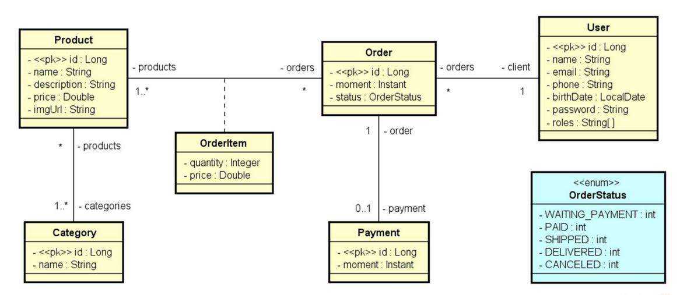

## PH COMMERCE

Backend de um sistema de e-commerce usando Java Spring.

## Modelo de domínio 

As entidades e relacionamentos foram modelados usando o modelo a seguir

## Arquitetura do sistema

O backend foi projetado utilizando a arquitetura de camadas, com as seguintes:
- Controller: escuta requisições do cliente;
- Service: implementa as lógicas de negócio;
- Repository: realiza operações atômicas no banco de dados.

A comunicação e troca de dados entre Controller e Service é feita usando DTOs, para reduzir tráfego na rede.