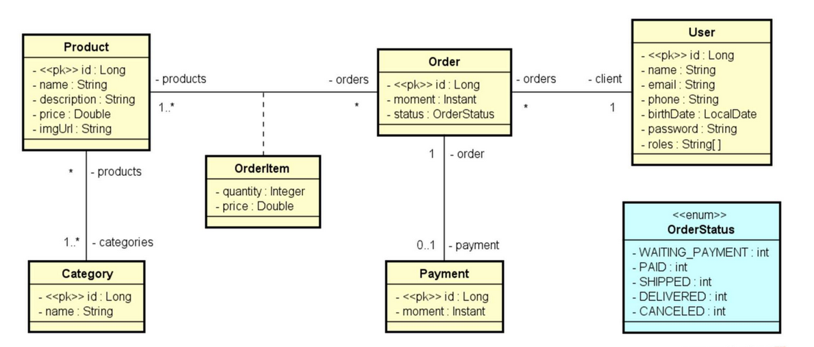

 ## PH COMMERCE

Backend de um sistema de e-commerce usando Java Spring.

## Modelo de domínio 

As entidades e relacionamentos foram modelados usando o modelo a seguir


## Arquitetura do sistema

O backend foi projetado utilizando a arquitetura de camadas, com as seguintes:
- Controller: escuta requisições do cliente;
- Service: implementa as lógicas de negócio;
- Repository: realiza operações atômicas no banco de dados.

A comunicação e troca de dados entre Controller e Service é feita usando DTOs, para reduzir tráfego na rede.

## Checklist de atividades

A lista abaixo apresenta uma visão geral das atividades do projeto que já foram realizadas (✅),
as que estão em andamento (⚙️) e os próximos passos (🛠️).

- Modelo de domínio e ORM: ✅ finalizado
- API REST: ✅ finalizado
- Exceções e validações: ✅ finalizado
- Login e controle de acesso: ✅ finalizado
- Homologação e CI/CD: ✅ finalizado

---

## Deploy 🚀

A aplicação está em produção no Railway e pode ser acessada em:

https://phcommerce-production.up.railway.app/

O backend também pode ser rodado localmente para desenvolvimento e testes.

## Como executar localmente 🧩

1. Clone o repositório:
   ```bash
   git clone <url-do-repositorio>
   cd phcommerce
   ```
2. Ajuste as configurações em `src/main/resources/application.properties` ou use perfis (`dev`, `prod`, `demo`).
3. Execute com Maven:
   ```bash
   ./mvnw spring-boot:run
   ```
   ou
   ```bash
   mvn spring-boot:run
   ```
4. A API estará disponível em `http://localhost:8080`.


